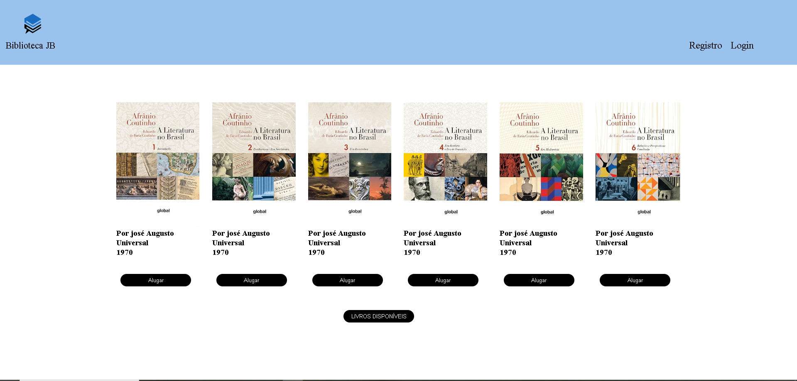
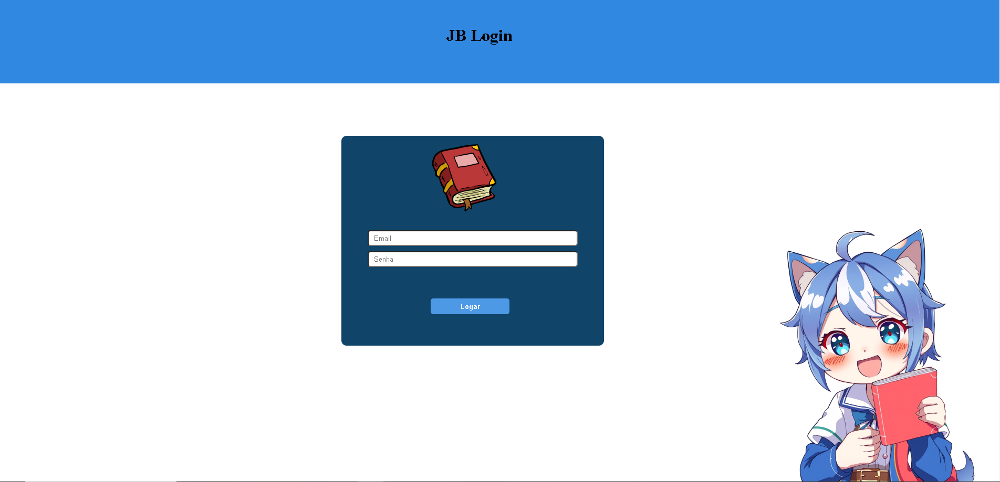
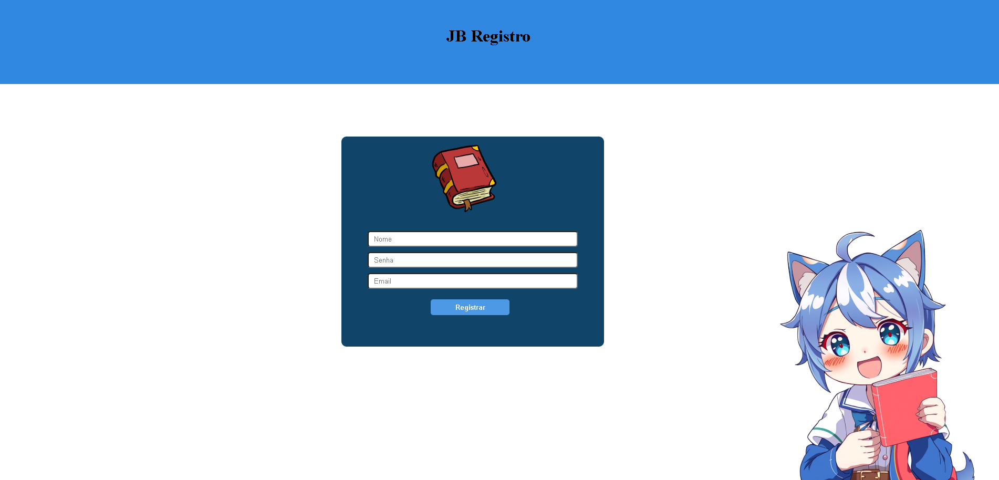

# Front-End APP Biblioteca

Parte inicial do Site/APP Biblioteca JB com consumo da API para login e cadastro, site desenvolvido em HTML, CSS e JavaScript.

## Objetivo

Este site foi desenvolvido com o objetivo de informatizar a biblioteca da escola.

## Screenshots

## Autores

Turma JB
